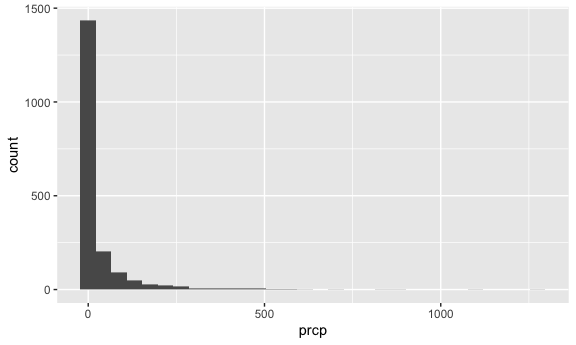
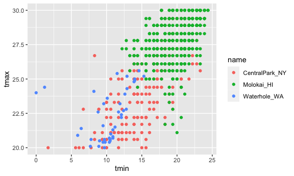
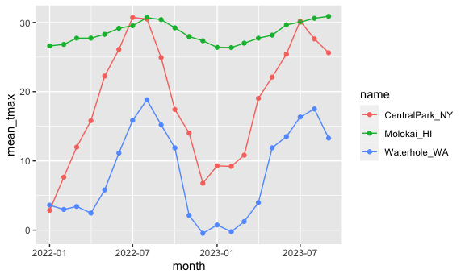

visualization part 1
================

\#总结：先用ggplot定义，然后在geom 去选择想要的图

``` r
library(tidyverse)
```

    ## ── Attaching core tidyverse packages ──────────────────────── tidyverse 2.0.0 ──
    ## ✔ dplyr     1.1.3     ✔ readr     2.1.4
    ## ✔ forcats   1.0.0     ✔ stringr   1.5.0
    ## ✔ ggplot2   3.4.3     ✔ tibble    3.2.1
    ## ✔ lubridate 1.9.2     ✔ tidyr     1.3.0
    ## ✔ purrr     1.0.2     
    ## ── Conflicts ────────────────────────────────────────── tidyverse_conflicts() ──
    ## ✖ dplyr::filter() masks stats::filter()
    ## ✖ dplyr::lag()    masks stats::lag()
    ## ℹ Use the conflicted package (<http://conflicted.r-lib.org/>) to force all conflicts to become errors

``` r
knitr::opts_chunk$set(
  fig.width = 6,
  fig.asp = .6,
  out.width = "90%"
)
```

Get the data for plotting

``` r
weather_df = 
  rnoaa::meteo_pull_monitors(
    c("USW00094728", "USW00022534", "USS0023B17S"),
    var = c("PRCP", "TMIN", "TMAX"), 
    date_min = "2022-01-01",
    date_max = "2023-12-31") |>
  mutate(
    name = recode(
      id, 
      USW00094728 = "CentralPark_NY", 
      USW00022534 = "Molokai_HI",
      USS0023B17S = "Waterhole_WA"),
    tmin = tmin / 10,
    tmax = tmax / 10, 
    month = lubridate::floor_date(date, unit = "month"))|>
  select(name, id, everything())
```

    ## using cached file: /Users/tianyouhe/Library/Caches/org.R-project.R/R/rnoaa/noaa_ghcnd/USW00094728.dly

    ## date created (size, mb): 2023-09-28 10:18:42.720289 (8.524)

    ## file min/max dates: 1869-01-01 / 2023-09-30

    ## using cached file: /Users/tianyouhe/Library/Caches/org.R-project.R/R/rnoaa/noaa_ghcnd/USW00022534.dly

    ## date created (size, mb): 2023-09-28 10:18:52.91428 (3.83)

    ## file min/max dates: 1949-10-01 / 2023-09-30

    ## using cached file: /Users/tianyouhe/Library/Caches/org.R-project.R/R/rnoaa/noaa_ghcnd/USS0023B17S.dly

    ## date created (size, mb): 2023-09-28 10:18:56.874532 (0.994)

    ## file min/max dates: 1999-09-01 / 2023-09-30

## Initial numeric work

``` r
 weather_df |>
  ggplot(aes(x = prcp)) +
  geom_histogram()
```

    ## `stat_bin()` using `bins = 30`. Pick better value with `binwidth`.

    ## Warning: Removed 30 rows containing non-finite values (`stat_bin()`).



``` r
weather_df|>
  filter(prcp > 1000)
```

    ## # A tibble: 2 × 7
    ##   name       id          date        prcp  tmax  tmin month     
    ##   <chr>      <chr>       <date>     <dbl> <dbl> <dbl> <date>    
    ## 1 Molokai_HI USW00022534 2022-12-18  1120  23.3  18.9 2022-12-01
    ## 2 Molokai_HI USW00022534 2023-01-28  1275  21.7  18.3 2023-01-01

``` r
weather_df|>
  filter(tmax >= 20, tmax <= 30) |>
  ggplot(aes(x = tmin, y = tmax, color = name)) +
  geom_point()
```



## Grouping

``` r
weather_df|>
  group_by(name)
```

    ## # A tibble: 1,914 × 7
    ## # Groups:   name [3]
    ##    name           id          date        prcp  tmax  tmin month     
    ##    <chr>          <chr>       <date>     <dbl> <dbl> <dbl> <date>    
    ##  1 CentralPark_NY USW00094728 2022-01-01   201  13.3  10   2022-01-01
    ##  2 CentralPark_NY USW00094728 2022-01-02    10  15     2.8 2022-01-01
    ##  3 CentralPark_NY USW00094728 2022-01-03     0   2.8  -5.5 2022-01-01
    ##  4 CentralPark_NY USW00094728 2022-01-04     0   1.1  -7.1 2022-01-01
    ##  5 CentralPark_NY USW00094728 2022-01-05    58   8.3  -0.5 2022-01-01
    ##  6 CentralPark_NY USW00094728 2022-01-06     0   5     1.1 2022-01-01
    ##  7 CentralPark_NY USW00094728 2022-01-07    97   1.1  -3.8 2022-01-01
    ##  8 CentralPark_NY USW00094728 2022-01-08     0  -1    -6.6 2022-01-01
    ##  9 CentralPark_NY USW00094728 2022-01-09    25   4.4  -1.6 2022-01-01
    ## 10 CentralPark_NY USW00094728 2022-01-10     0   4.4  -4.3 2022-01-01
    ## # ℹ 1,904 more rows

## Counting

``` r
weather_df|>
  group_by( month)|>
  summarize(n_obs = n())
```

    ## # A tibble: 21 × 2
    ##    month      n_obs
    ##    <date>     <int>
    ##  1 2022-01-01    93
    ##  2 2022-02-01    84
    ##  3 2022-03-01    93
    ##  4 2022-04-01    90
    ##  5 2022-05-01    93
    ##  6 2022-06-01    90
    ##  7 2022-07-01    93
    ##  8 2022-08-01    93
    ##  9 2022-09-01    90
    ## 10 2022-10-01    93
    ## # ℹ 11 more rows

``` r
weather_df|>
  count(name, name = "n_obs")
```

    ## # A tibble: 3 × 2
    ##   name           n_obs
    ##   <chr>          <int>
    ## 1 CentralPark_NY   638
    ## 2 Molokai_HI       638
    ## 3 Waterhole_WA     638

``` r
weather_df|>
  count(name, month)|>
  pivot_wider(
    names_from = name, 
    values_from = n
  )
```

    ## # A tibble: 21 × 4
    ##    month      CentralPark_NY Molokai_HI Waterhole_WA
    ##    <date>              <int>      <int>        <int>
    ##  1 2022-01-01             31         31           31
    ##  2 2022-02-01             28         28           28
    ##  3 2022-03-01             31         31           31
    ##  4 2022-04-01             30         30           30
    ##  5 2022-05-01             31         31           31
    ##  6 2022-06-01             30         30           30
    ##  7 2022-07-01             31         31           31
    ##  8 2022-08-01             31         31           31
    ##  9 2022-09-01             30         30           30
    ## 10 2022-10-01             31         31           31
    ## # ℹ 11 more rows

## General summaries

``` r
weather_df|>
  group_by(name, month)|>
  summarize(
    mean_tmax = mean(tmax, na.rm = FALSE),
    median_tmax = median(tmax, na.rm = TRUE),
    sd_tmax = sd(tmax, na.rm = TRUE)
  )
```

    ## `summarise()` has grouped output by 'name'. You can override using the
    ## `.groups` argument.

    ## # A tibble: 63 × 5
    ## # Groups:   name [3]
    ##    name           month      mean_tmax median_tmax sd_tmax
    ##    <chr>          <date>         <dbl>       <dbl>   <dbl>
    ##  1 CentralPark_NY 2022-01-01      2.85         2.8    5.11
    ##  2 CentralPark_NY 2022-02-01      7.65         7.5    6.79
    ##  3 CentralPark_NY 2022-03-01     12.0         11.1    6.27
    ##  4 CentralPark_NY 2022-04-01     15.8         15.3    4.36
    ##  5 CentralPark_NY 2022-05-01     22.3         22.2    5.24
    ##  6 CentralPark_NY 2022-06-01     26.1         26.1    3.07
    ##  7 CentralPark_NY 2022-07-01     30.7         30      2.24
    ##  8 CentralPark_NY 2022-08-01     30.5         30.6    2.65
    ##  9 CentralPark_NY 2022-09-01     24.9         25      3.94
    ## 10 CentralPark_NY 2022-10-01     17.4         17.2    3.35
    ## # ℹ 53 more rows

``` r
weather_df|>
  group_by(name, month)|>
  summarise( mean_tmax = mean(tmax, na.rm = TRUE))|>
  ggplot(aes(x = month, y = mean_tmax, color = name))+
  geom_point() + 
  geom_line()
```

    ## `summarise()` has grouped output by 'name'. You can override using the
    ## `.groups` argument.



``` r
weather_df|>
  group_by(name, month)|>
  summarise( mean_tmax = mean(tmax, na.rm = TRUE))|>
  pivot_wider(
    names_from = name,
    values_from = mean_tmax
  )
```

    ## `summarise()` has grouped output by 'name'. You can override using the
    ## `.groups` argument.

    ## # A tibble: 21 × 4
    ##    month      CentralPark_NY Molokai_HI Waterhole_WA
    ##    <date>              <dbl>      <dbl>        <dbl>
    ##  1 2022-01-01           2.85       26.6         3.61
    ##  2 2022-02-01           7.65       26.8         2.99
    ##  3 2022-03-01          12.0        27.7         3.42
    ##  4 2022-04-01          15.8        27.7         2.46
    ##  5 2022-05-01          22.3        28.3         5.81
    ##  6 2022-06-01          26.1        29.2        11.1 
    ##  7 2022-07-01          30.7        29.5        15.9 
    ##  8 2022-08-01          30.5        30.7        18.8 
    ##  9 2022-09-01          24.9        30.4        15.2 
    ## 10 2022-10-01          17.4        29.2        11.9 
    ## # ℹ 11 more rows
